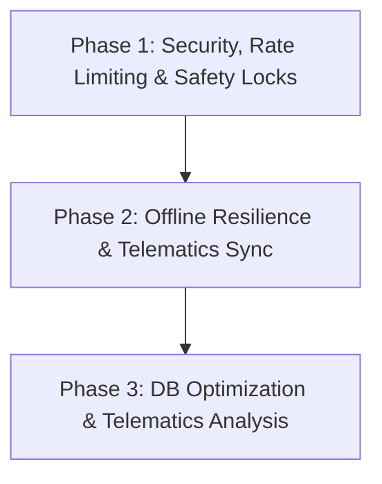

# SafeRide - GSD Production Readiness Plan

This document outlines the phased roadmap to prepare the **SafeRide** (Intelligent Student Bus Monitoring) system for final production deployment.

---

## Roadmap Overview

---

## Phase 1: Security, Rate Limiting & Safety Locks

### Objectives
Secure all operational endpoints, protect API triggers from brute-force/billing abuse, and enforce safety rules to guarantee data integrity.

### Tasks
1.  **Endpoint Authentication Audits**: Ensure every `/api/students/*`, `/api/drivers/*`, `/api/buses/*`, and `/api/trips/*` route enforces role-based authorization via token validation.
2.  **SMS Rate Limiting & Protection**: Enforce a 5-minute cooldown on SMS alerts sent to parent contacts to prevent Twilio balance depletion.
3.  **Client-Side Throttling**: Rate-limit QR code scans to 10/second and GPS updates to once every 5 seconds to reduce browser overhead.
4.  **Operational Safety Locks**: Block deleting buses or drivers who have active trips running. Block driver unassignment when a trip is active.

### Estimated Complexity
*   **Complexity**: Medium
*   **Duration**: 3 Days

### Risks & Mitigations
*   **Risk**: Incorrect middleware routing might accidentally lock out genuine parent dashboard queries.
*   **Mitigation**: Run automated integration tests asserting guest vs. driver vs. admin access policies on every endpoint.

### Verification Criteria
*   [ ] Anonymous users get `401 Unauthorized` on protected routes.
*   [ ] Multiple student scans within 5 minutes trigger a single SMS parent alert.
*   [ ] Deleting an active bus/driver is rejected with a `400 Bad Request`.

---

## Phase 2: Offline Resilience & Telematics Sync

### Objectives
Support offline operation during cellular blackouts, allowing drivers to buffer scans and coordinates locally and synchronize them reliably when network status recovers.

### Tasks
1.  **Webcam Heartbeat Monitor**: Implement a periodic webcam status check to catch camera disconnections and prompt automatic restarts.
2.  **GPS Signal Loss Alerts**: Show prominent warnings on the driver's interface if GPS data is not received for 20 seconds.
3.  **IndexedDB Telemetry Buffer**: Buffer telemetry pings and QR scan logs in local storage (IndexedDB/LocalStorage) during offline state.
4.  **Batch Synchronization Endpoint**: Process offline buffers in a single transaction on backend reconnect, checking validations (e.g. occupancy constraints).

### Estimated Complexity
*   **Complexity**: Medium-High
*   **Duration**: 4 Days

### Risks & Mitigations
*   **Risk**: Offline synchronization might conflict with real-time updates if order of arrival is mixed.
*   **Mitigation**: Order all telemetry by client-side timestamps and perform geofencing checks on the final point.

### Verification Criteria
*   [ ] Driver dashboard correctly warns about GPS loss or webcam disconnections.
*   [ ] Data syncs seamlessly upon network reconnection without database corruption.

---

## Phase 3: DB Optimization & Telematics Analysis

### Objectives
Maximize database read/write speeds, optimize index coverage, and add telematics analysis routines to detect speed anomalies.

### Tasks
1.  **Database Indexing**: Create indexes on `ScanLog(student_id, time)`, `Trip(status, busId)`, and `LiveLocation(tripId, timestamp)`.
2.  **GPS Spoofing Detection**: Bound allowable bus speeds using environmental constants (`MAX_BUS_SPEED_KMH`) and flag coordinates with extreme speed jumps.
3.  **Active Trip Auto-Recovery**: During server bootstrap, automatically recalculate occupancy rates from scan records and fix corrupted statuses.

### Estimated Complexity
*   **Complexity**: Medium
*   **Duration**: 2 Days

### Risks & Mitigations
*   **Risk**: GPS spoofing checks might throw false warnings during brief GPS signal jumps.
*   **Mitigation**: Apply a sliding window moving average to coordinates before speed calculations.

### Verification Criteria
*   [ ] Database queries resolve in <50ms.
*   [ ] Simulated spoofed coordinates are successfully flagged as suspicious.
